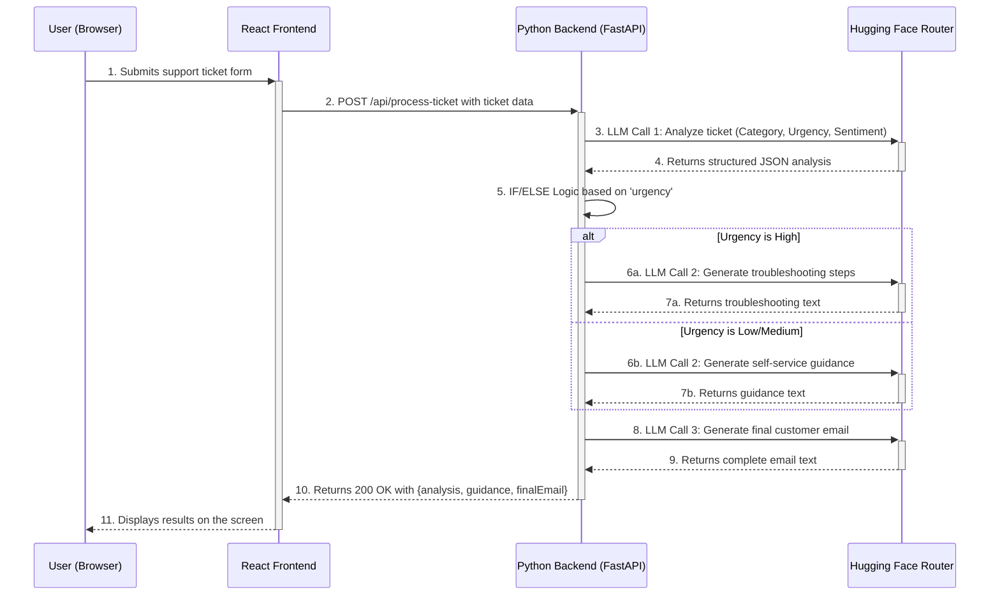

# AI Support Ticket Router

This is a full-stack application that uses AI to analyze, route, and respond to customer support tickets. It analyzes incoming tickets for category, urgency, and sentiment, then generates tailored guidance and a draft email response based on the ticket's urgency.

## Architecture

The application uses a decoupled frontend/backend architecture:
- **Frontend:** A React single-page application built with Vite.
- **Backend:** A Python API server built with FastAPI.
- **AI Service:** Hugging Face Router for Large Language Model (LLM) calls.



## Tech Stack

- **Frontend:** React, Vite, Axios
- **Backend:** Python, FastAPI, Uvicorn, OpenAI Client, python-dotenv
- **AI:** Hugging Face Router (`meta-llama/Llama-3.1-8B-Instruct`)

## Setup and Installation

### Prerequisites
- Node.js and npm
- Python and pip
- A Hugging Face API Token with "Read" access.

### Backend Setup

1.  Navigate to the `backend` directory: `cd backend`
2.  Create and activate a virtual environment:
    ```bash
    # On Windows
    python -m venv venv
    .\venv\Scripts\activate
    ```
3.  Install dependencies: `pip install -r requirements.txt`
4.  Create a `.env` file in the `backend` directory and add your API key:
    ```
    HUGGING_FACE_API_KEY=hf_YourSecretTokenGoesHere
    ```
5.  Run the server: `uvicorn main:app --reload`
    The backend will be running at `http://localhost:8000`.

### Frontend Setup

1.  In a new terminal, navigate to the `frontend` directory: `cd frontend`
2.  Install dependencies: `npm install`
3.  Run the development server: `npm run dev`
    The frontend will be running at `http://localhost:5173` and is ready to connect to the backend.